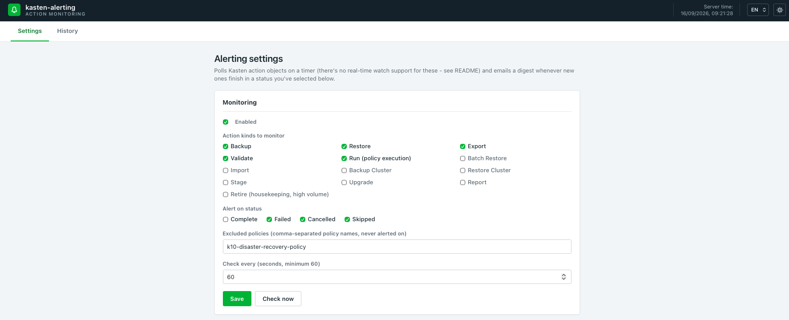
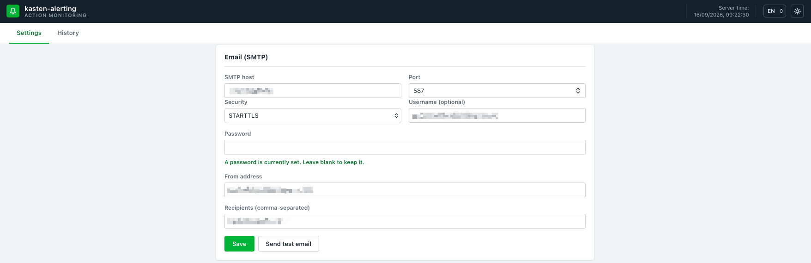
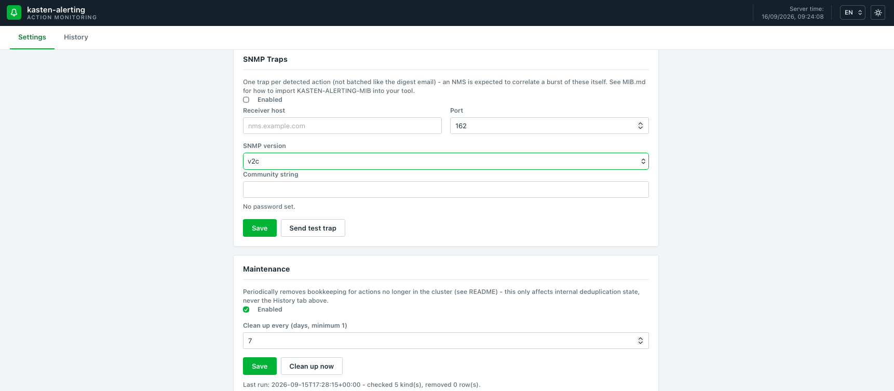

# kasten-alerting

Alerts on Veeam Kasten action failures (and any other outcome you care
about) by email and/or SNMP trap - BackupAction, RestoreAction,
ExportAction, RunAction, and every other action kind Kasten exposes.

---

## Why this polls instead of watching

Kasten explicitly disables `watch` on every `actions.kio.kasten.io` kind.

So there's no event-driven alternative - this app periodically lists every
selected action kind and diffs against what it's already seen. 
The interval is configurable on the Settings page (minimum 60s).

**First-run safety**: the very first time a given action kind is polled,
either this app's first-ever boot, or the first poll after you newly
select a kind in Settings, every currently-terminal object of that kind
is silently marked "seen" without triggering an alert (a "baseline" pass).
Without this, turning on e.g. Retire (which can already have thousands of
objects on a cluster with a long history) would otherwise dump its entire
backlog into one digest email. From the next poll onward, only genuinely
new terminal-state actions are ever reported.

## What triggers an alert

Email and SNMP are two independent delivery channels, each with its own
"Enabled" toggle in Settings - turn on either, both, or neither. Both fire
from the exact same underlying detection (a new action whose kind and
status you've selected), just packaged differently:

- **Email**: one digest per poll cycle that found at least one new
  matching action, not one email per action, so an incident that fails
  many actions at once (a storage outage, say) can't flood your inbox.
  Each digest lists every action it covers: kind, action name, policy name
  (when the action came from a policy - `k10.kasten.io/policyName`),
  Location Profile (for ExportAction/ImportAction/BackupAction), namespace,
  timestamp, and, for anything that failed, the full error/cause chain
  Kasten recorded on the object itself (`status.error`).
- **SNMP trap**: one `kastenActionAlertTrap` per action, not batched - an
  NMS is built to correlate a burst of these itself, unlike an inbox. See
  [MIB.md](MIB.md) for the full object reference, NMS import instructions,
  and prerequisites (including an SNMPv3-specific requirement that will
  silently break every trap if missed).

Toggling either channel off in Settings doesn't stop the underlying
polling/bookkeeping, only that channel's delivery - so nothing piles up
into a flood the moment you turn it back on.

## Action kinds monitored

Every kind that supports `get`/`list` (13 of the 14 `actions.kio.kasten.io`
kinds - `CancelAction` only supports `create`, so there's nothing on it to
ever poll): **BackupAction, RestoreAction, ExportAction, ValidateAction,
RunAction**, BatchRestoreAction, ImportAction, BackupClusterAction,
RestoreClusterAction, StageAction, UpgradeAction, ReportAction, and
RetireAction. 
The first five are selected by default; the rest (mostly
rarer or, in Retire's case, very high-volume housekeeping) are available
to enable in Settings but off by default.

Statuses: `Complete`, `Failed`, `Cancelled`, `Skipped` (one shared filter
across every selected kind). Only `Failed` is on by default - the one
unambiguous "something is actually wrong" outcome; `Cancelled`/`Skipped`
(usually a manual cancel, a policy skipping a namespace it
already handled) and `Complete` (a full audit trail of successes too) are
available to enable in Settings.

---

## SNMP prerequisites

The full reference lives in [MIB.md](MIB.md) - this is the short version
of what has to be true before "Send test trap" will actually arrive
somewhere.

**Network:**
- UDP egress from the kasten-alerting pod to your NMS, on the configured
  port (default `162`; many environments use a non-privileged port like
  `1162` instead, since binding `162` needs root on the receiver). If
  there's a firewall between the cluster and the NMS - common, since the
  NMS is often on a different network segment - open that port explicitly.
  There's no way to detect a blocked port from kasten-alerting's side:
  TRAP is fire-and-forget UDP, so a "sent successfully" locally doesn't
  mean the NMS ever received it.
- No inbound access needed - kasten-alerting only ever sends, never
  listens for anything SNMP-related.

**On the NMS:**
- Import `mibs/KASTEN-ALERTING-MIB.mib` if you want traps to render with
  real field names instead of raw numeric OIDs (not required for the trap
  to be *received*, only to be *readable*).
- **v2c**: a community string matching what's configured in Settings.
- **v3**: username + auth/priv passwords matching, **plus** the NMS must
  be told kasten-alerting's own SNMPv3 Engine ID in advance (shown on the
  Settings page) - this is a real RFC 3414 requirement for TRAP specifically
  (as opposed to a GET/SET), not an implementation quirk, and skipping it
  silently drops every authenticated trap. See MIB.md's SNMPv3 section for
  exactly why and how to configure it, confirmed against a real
  `snmptrapd` during development.

---

## Maintenance

The dedup bookkeeping that keeps poller.py from alerting on the same
action twice (`seen_actions`, see `app/db.py`) only ever grows on its own -
even for actions Kasten itself has since garbage-collected (RunAction and
RetireAction especially churn through thousands of objects over a
cluster's lifetime). A background task reconciles it against what's
actually still in the cluster and deletes rows for anything gone, weekly
by default - configurable (interval in days) or triggerable on demand
("Clean up now") from the Settings page. This only ever touches internal
deduplication state, never the History tab's own record of alerts sent.

---

## Deploying

The image is published at `docker.io/cpouthier/kasten-alerting` (multi-arch:
`linux/amd64` + `linux/arm64`) - the chart already points at it by default,
no build step needed.

### Standard Kubernetes

```bash
helm upgrade --install kasten-alerting ./helm/kasten-alerting \
  --namespace kasten-alerting --create-namespace \
  --set storageClass=<your-storage-class> \
  --set timezone=Europe/Paris
```

- `storageClass` is required - must already exist in your cluster
  (`kubectl get storageclass`). Backs the 1Gi PVC holding `settings.json`
  and the SQLite dedup/history database (`app/settings.py`, `app/db.py`).
- `timezone` (an IANA name, e.g. `Europe/Paris`) is what the digest email
  and History tab display timestamps in - Kasten's own timestamps are
  always UTC regardless of where the cluster physically runs, so without
  this every timestamp reads a few hours off from your own wall-clock
  time. Defaults to `UTC`. This can't be auto-detected from the cluster
  itself - see `app/tz.py`'s docstring for why.
- `service.type` defaults to `LoadBalancer` (e.g. MetalLB). If your
  cluster has no LoadBalancer implementation, switch to `ClusterIP`
  (`--set service.type=ClusterIP`) and reach it with
  `kubectl -n kasten-alerting port-forward svc/kasten-alerting 8080:80`
  instead.

### OpenShift

Same chart - swap the LoadBalancer Service for a Route:

```bash
helm upgrade --install kasten-alerting ./helm/kasten-alerting \
  --namespace kasten-alerting --create-namespace \
  --set storageClass=<your-storage-class> \
  --set timezone=Europe/Paris \
  --set service.type=ClusterIP \
  --set route.enabled=true
```

- `route.host` pins a specific hostname (`--set
  route.host=kasten-alerting.apps.example.com`); left empty, OpenShift
  generates one from the route name + namespace + cluster's default
  subdomain.
- `route.tls.termination` defaults to `edge` (TLS ends at the router -
  this app itself only ever serves plain HTTP).
- No SecurityContextConstraints changes needed: this app never requests a
  privileged container or any non-default SCC.
- At runtime, the app itself detects OpenShift (checking for the
  `security.openshift.io` API group) and uses `oc` instead of `kubectl`
  for every cluster call from then on, matching what a human operator
  would use - see `app/k10.py`'s `_kubectl_binary`. Nothing to configure
  for this; it's automatic either way.

---

## RBAC

Two separate objects, deliberately scoped as narrowly as each job allows -
see `helm/kasten-alerting/templates/{clusterrole,role}.yaml` for the exact
YAML.

**ClusterRole `kasten-alerting`** (cluster-scoped, bound cluster-wide via
`ClusterRoleBinding`) - `get`/`list` only, on the 13 `actions.kio.kasten.io`
kinds this app can poll:

```
backupactions, backupclusteractions, batchrestoreactions, exportactions,
importactions, reportactions, restoreactions, restoreclusteractions,
retireactions, runactions, stageactions, upgradeactions, validateactions
```

This has to be cluster-scoped: an action lives in whichever namespace its
source application does (or has no namespace at all for the three
cluster-scoped kinds - BackupClusterAction, RestoreClusterAction,
RetireAction), not a fixed namespace this chart controls, and this app
needs to see every one of them regardless of where they land. `get`/`list`
only - this app only ever observes, it never creates, deletes, or modifies
a Kasten action. `CancelAction` (the 14th `actions.kio.kasten.io` kind) is
deliberately absent: its API only supports `create` (it's a command, not a
queryable object), so a `get`/`list` grant on it would be meaningless.

**Role `kasten-alerting`** (namespaced, bound only within the release
namespace via `RoleBinding`) - on `secrets`:

```
get, list, watch, create, patch, delete
```

This app only ever touches two Secrets, always in its own namespace: the
SMTP password (`kasten-alerting-smtp`) and, if SNMP trapping is enabled,
the v2c community string / v3 auth+priv passwords (`kasten-alerting-snmp`)
- so unlike the action kinds above, this is intentionally *not* in the
ClusterRole, which would otherwise mean a grant on every Secret in every
namespace cluster-wide. `create`+`patch` because saving either goes
through `kubectl apply` (create on the first save, patch on every one
after); `delete` is for clearing credentials from the Settings page. Both
are write-only end to end: the API never returns any of them once saved,
only whether each is currently set (`has_password`, `snmp_credentials`).

Nothing else is granted - no access to Pods, logs, ConfigMaps, or any
other resource. Unlike malware-scan (which restores data into scratch
namespaces and runs scanner pods), this app only ever reads Kasten action
objects and manages its own two Secrets.

---

## User Guide

Everything below lives on the single Settings page (History is the other
tab - one row per digest email actually sent, click a row to see every
action it covered).

### Monitoring



- **Enabled** - the master switch for the digest email specifically (see
  [What triggers an alert](#what-triggers-an-alert) above); SNMP has its
  own independent toggle further down.
- **Action kinds to monitor** - which of the 13 pollable Kasten action
  kinds to watch. Backup/Restore/Export/Validate/Run are on by default;
  the rest (mostly rarer, or in Retire's case very high-volume
  housekeeping) are opt-in.
- **Alert on status** - the shared status filter across every selected
  kind (`Complete`/`Failed`/`Cancelled`/`Skipped`). Only `Failed` is on by
  default.
- **Excluded policies** - policy names to never alert on even if they'd
  otherwise match, e.g. a cluster's own DR policy.
- **Check every** - the poll interval in seconds (minimum 60). **Check
  now** runs one cycle immediately, without waiting for the interval -
  useful right after changing a setting.

### Email (SMTP)



Standard SMTP fields (host, port, STARTTLS/SSL/TLS/none, optional
username), plus **From address** and **Recipients**. The password field
is write-only - once saved, it's never shown again, only "A password is
currently set" (in green, as above) or "No password set" until you type a
new one. **Send test email** tries the form's *current* values (falling
back to the already-saved password if you leave that field blank), so you
can verify a config before committing to it with **Save**.

### SNMP Traps and Maintenance



**SNMP Traps** - its own **Enabled** toggle, independent of the email
one above. Set the **Receiver host**/**Port** (default `162`) and pick a
**SNMP version**:
- **v2c** just needs a **Community string**.
- **v3** additionally asks for a username, an authentication protocol
  (SHA/MD5/none) + password, and a privacy protocol (AES/DES/none) +
  password - and, critically, shows **this app's own SNMPv3 Engine ID**,
  which your NMS needs to be told in advance before it will accept an
  authenticated trap at all (see [MIB.md](MIB.md) for exactly why - it's
  a real SNMPv3 requirement for traps specifically, not a bug, and it's
  easy to miss).

All three password-type fields (community string, auth password, priv
password) are write-only, same "currently set / not set" pattern as the
SMTP password. **Send test trap** exercises the exact same code path as a
real alert, against whatever's currently in the form.

**Maintenance** - unrelated to alerting itself: the dedup bookkeeping
that stops the same action from being alerted on twice only ever grows on
its own, even for actions Kasten has since garbage-collected. This section
lets you turn that cleanup on/off, set how often it runs (in days, weekly
by default), trigger it on demand with **Clean up now**, and see the
result of the last run (how many action kinds were checked, how many
stale rows were removed, or the error if it failed). It only ever touches
this internal bookkeeping - never the History tab's own record of alerts
already sent.
